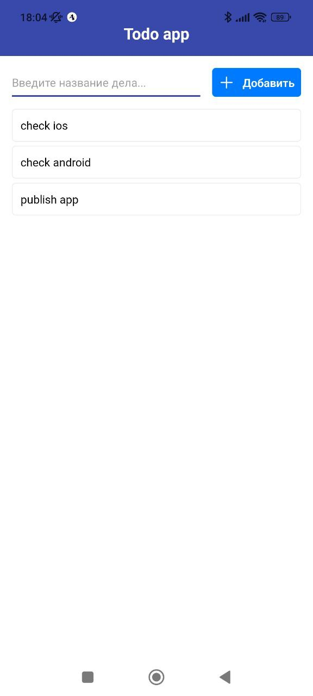
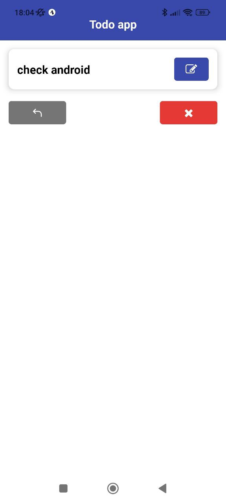

# Expo todo app
<span></span>

## Try
You can touch the app with Expo Go https://expo.dev/@divasilevski/react-native-todo-app

## Firebase Database
- Create new project https://console.firebase.google.com/
- Create the Realtime Database
- Change the rules to true
- Сopy path to the database

## Envs
- Add `.env` file to project folder
- Add to file `FIREBASE_DATABASE_URL="***"`

## Run
```
yarn
yarn start -c
```
